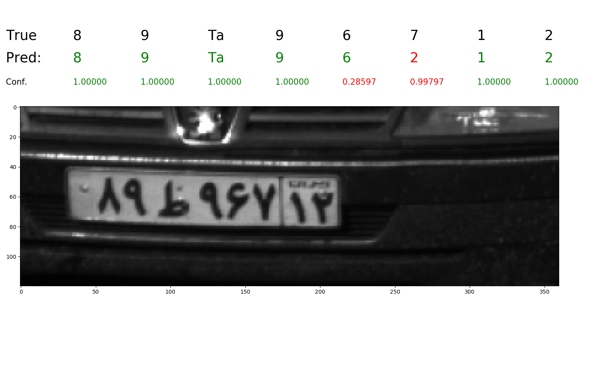
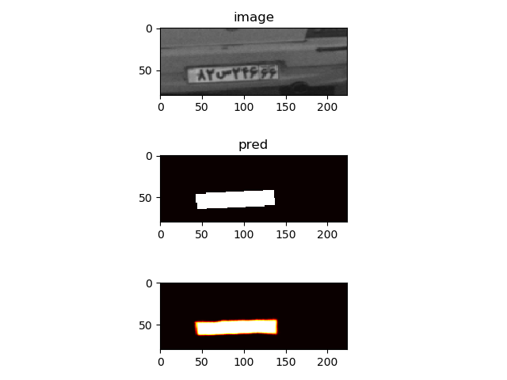
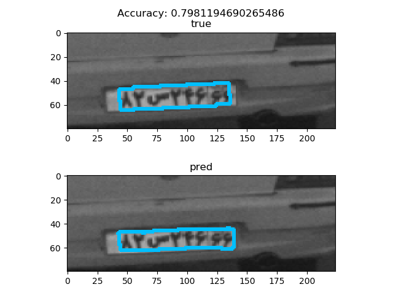

# ALPR-DeepNN
In this project we designed an end-to-end segmentation free Automatic License Plate Recognition (ALPR) model based on deep neural networks, in order to locate  car license plates in images and and extract registered number on the plate. 
## Softwares and Technology
- Python 3.5 or above
- Keras 
- Tensorflow
## How to use
### Data Preparation
In our project, each image file has a metadata file with extension '.a' that contains all information related to that image consisting of License Plate label and address of any related file to that image.
prepare_data.py : Reading these metadata files, all data is gathered together and splitted and After that the splitted data are processed and imported to a HDF5 file.
update_data.py : In order to update HDF5 file. Since the data is labeled by another algorithm and label checking is taking place frequently and the labels are being updated, so the '.a' files can be modified frequently.
### Training Phase
train.py : After importing the configurations of the model in src/config.py file and redesigning the NN architecture in src/Hybrid/construct_model.py, the model can be trained by running this code.
### Evaluation and Prediction Phase
evaluate.py : The trained model can be evaluated by running this code.
predict.py : any new data can be made predictions on by this code under some circumstances. First, if the trained model is trained in 'OCR'  or 'Hybrid' mode since it containes non-convolutional layers, it accepts fixed sized images as input. Otherwise for Locating phase any image with any size can be given to model as input. 
### Results
In the evaluation phase, if the confidences calculated in the annomaly detection phase, for a digit is colored in green, it means that it has passed the confidence threshold for that specific class in that specific digit location, otherwise it will be colored in red indicating that the model is not confident enough in prediction that digit. Confidence being green for all the digits shows that the model confidently predicted the whole license plate.
### OCR:

### Detection:

